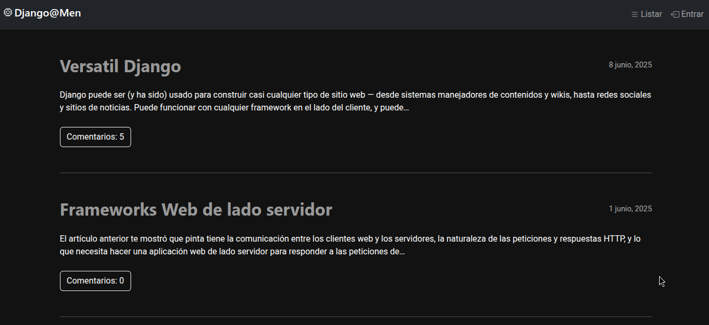
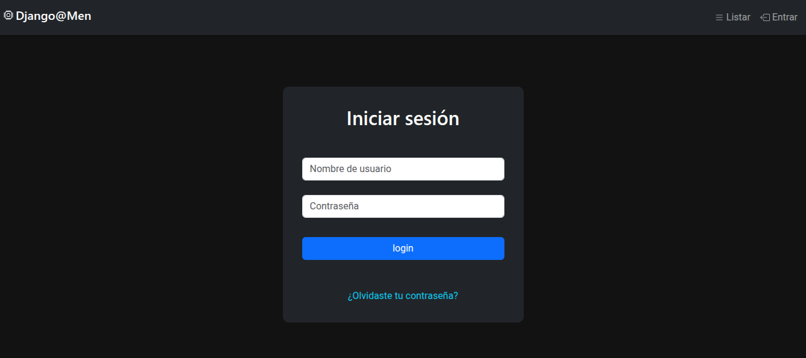
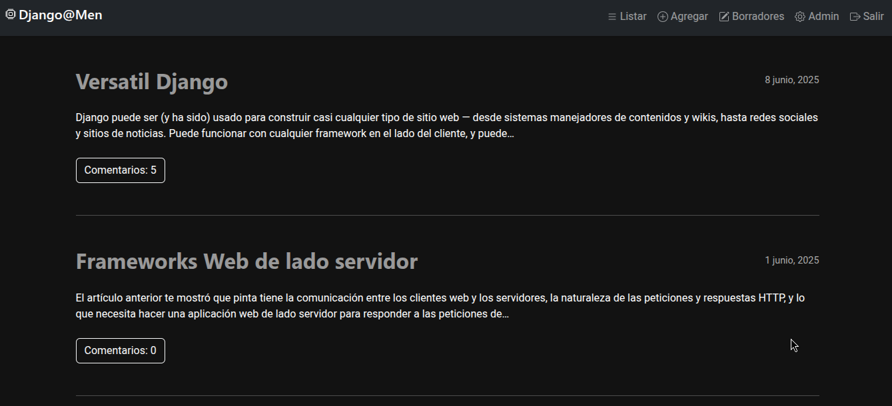
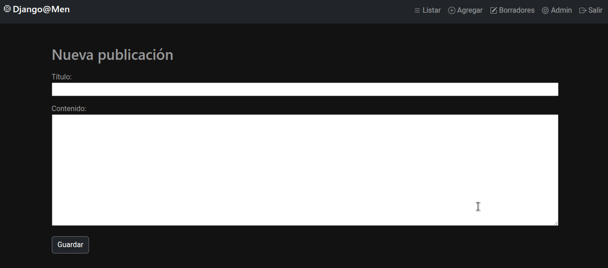
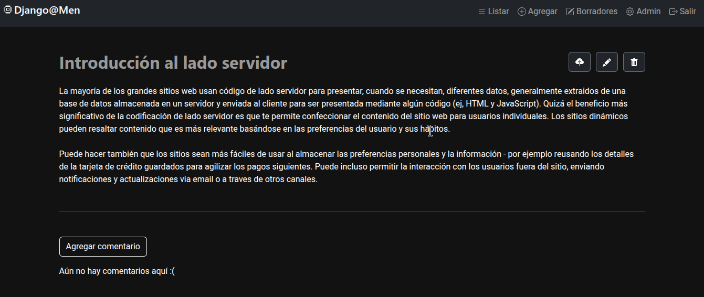

# djangomen
Example from the Django Girls tutorial.

Home page of the blog without logging in.

Login to manage the blog

Page with the blog administration menu.

Add new post.

Publish, edit, and delete a post.
